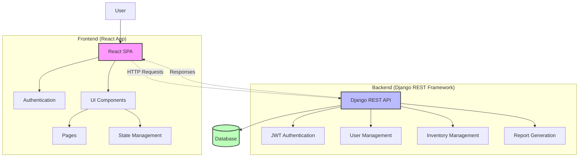
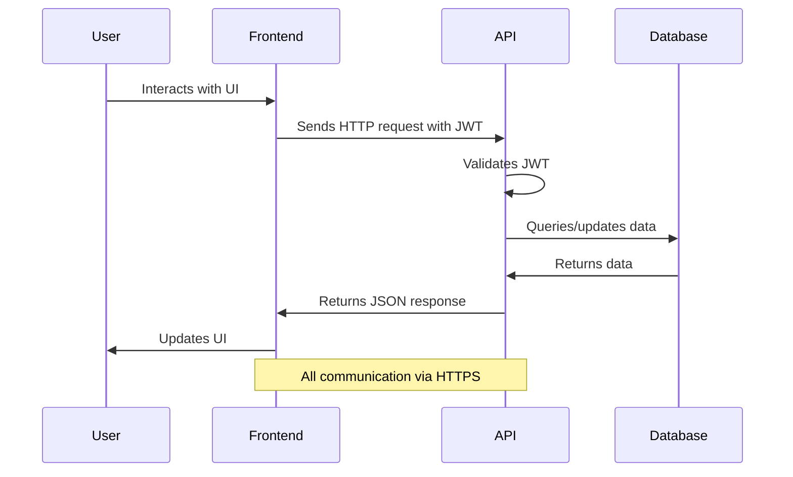
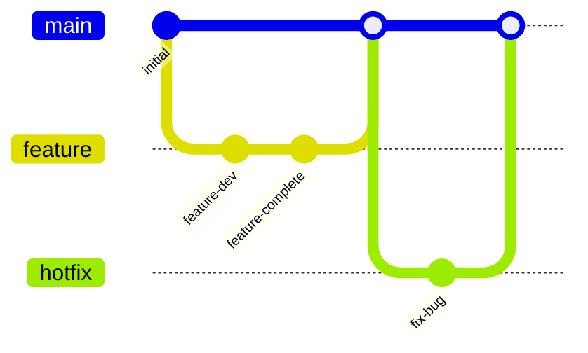

# Chemical Inventory System: Architecture Overview

## System Architecture

The Chemical Inventory System follows a modern client-server architecture with a clear separation between the frontend and backend components. This separation allows for independent development, testing, and deployment of each component.

## Component Breakdown

### Frontend Components

| Component | Technology | Purpose |
|-----------|------------|---------|
| React SPA | React 18.2 | Single page application providing the user interface |
| Authentication | JWT | Handle user authentication and session management |
| UI Components | Material-UI | Reusable UI components for consistent user experience |
| Pages | React Router | Different views and screens of the application |
| State Management | React Context/Redux | Manage application state and data flow |

### Backend Components

| Component | Technology | Purpose |
|-----------|------------|---------|
| Django REST API | Django 4.2.7, DRF 3.14.0 | Provide RESTful API endpoints for the frontend |
| JWT Authentication | djangorestframework-simplejwt 5.3.0 | Handle authentication and authorization |
| User Management | Django authentication | Manage user accounts, roles, and permissions |
| Inventory Management | Custom Django models | Core functionality for managing chemical inventory |
| Report Generation | ReportLab/Pandas | Generate PDF and Excel reports |
| Database | SQLite/PostgreSQL | Store application data |

## Data Flow Architecture

1. User interacts with the frontend interface.
2. Frontend makes authenticated HTTP requests to the backend API.
3. Backend validates the authentication token and processes the request.
4. Backend interacts with the database to retrieve or update data.
5. Backend sends a response back to the frontend.
6. Frontend updates the UI based on the received data.

## Technology Stack

### Frontend
- **React**: JavaScript library for building user interfaces
- **React Router**: For client-side routing
- **Material-UI**: Component library for consistent design
- **Axios**: HTTP client for API requests
- **JWT-Decode**: For handling JWT tokens

### Backend
- **Django**: Web framework for the backend
- **Django REST Framework**: For building RESTful APIs
- **djangorestframework-simplejwt**: JWT authentication
- **drf-spectacular**: API documentation
- **django-cors-headers**: Handle CORS for cross-domain requests
- **python-dotenv**: Environment variable management

### Database
- **SQLite**: Development database
- **PostgreSQL**: Production database (recommended)

### DevOps & Deployment
- **Docker**: Containerization
- **Git**: Version control
- **GitHub Actions/Jenkins**: CI/CD pipelines

## Key Design Decisions

### Backend Architecture
- **Django REST Framework**: Chosen for its robust feature set, security, and developer productivity.
- **JWT Authentication**: Provides stateless authentication suitable for RESTful APIs and SPAs.
- **Custom Django models**: Tailored to chemical inventory management needs with comprehensive validation.

### Database Schema
- **Normalized structure**: Reduces data redundancy and ensures data integrity.
- **Foreign Key Relationships**: Enforces referential integrity between related entities.
- **Indexes**: Applied to frequently queried fields for performance optimization.

### API Design
- **RESTful principles**: Resources are represented as endpoints with standard HTTP methods.
- **Pagination**: Implemented for list endpoints to handle large datasets efficiently.
- **Filtering and searching**: Allows clients to request specific subsets of data.
- **Versioning**: API versioning to ensure backward compatibility.

### Chemical Inventory Management
- **Comprehensive chemical models**: Captures all necessary information for proper inventory management.
- **Hazard tracking**: Records safety information for each chemical.
- **Location management**: Organizes chemicals by storage location and conditions.
- **Quantity tracking**: Monitors stock levels with low-stock alerts.
- **Expiry date monitoring**: Tracks expiration dates to ensure safety.

## Scalability Considerations

1. **Database optimization**: Indexes on frequently queried fields, optimized queries.
2. **Caching**: Implementation of Django's caching framework for frequently accessed data.
3. **Asynchronous processing**: For report generation and other resource-intensive tasks.
4. **Horizontal scaling**: Architecture supports adding more API servers behind a load balancer.
5. **Database scaling**: Support for database replication and sharding if needed.

## Security Measures

1. **Authentication**: JWT-based authentication with regular token rotation.
2. **Authorization**: Role-based access control for different user types.
3. **Input validation**: Comprehensive validation of all user inputs.
4. **HTTPS**: All communications encrypted using HTTPS.
5. **CORS**: Proper configuration of Cross-Origin Resource Sharing.
6. **Password security**: Bcrypt hashing for password storage.
7. **Protection against common vulnerabilities**: CSRF protection, XSS prevention.
8. **Rate limiting**: Protection against brute-force and DoS attacks.

## Development Workflow

1. **Feature branches**: New features developed in separate branches.
2. **Pull requests**: Code reviews required before merging to main.
3. **CI/CD pipeline**: Automated testing and deployment.
4. **Environment stages**: Development, staging, and production environments.
5. **Testing**: Unit tests, integration tests, and end-to-end tests.

## Monitoring and Logging

1. **Application logs**: Structured logging of application events.
2. **Error tracking**: Capturing and notifying about unexpected errors.
3. **Performance monitoring**: Tracking of API response times and resource usage.
4. **User activity auditing**: Logging of critical user actions for compliance.
5. **Health checks**: Regular monitoring of system health. 